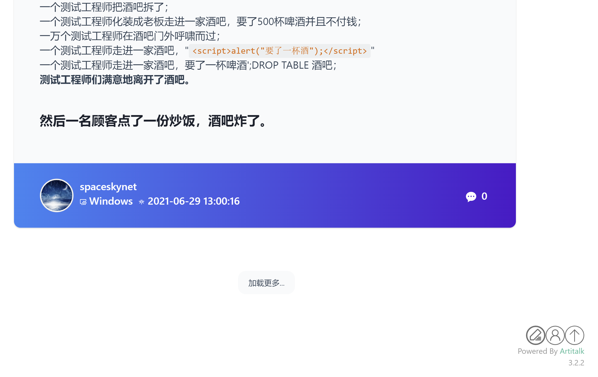

# Artitalk.js For hexo-fluid


大肆魔改了 Artitalk 的 css 使其和 hexo-fluid 主题相适应，参考了 Htalk 的说说风格。

使用 cdn 引用 js 文件即可，`https://cdn.staticaly.com/gh/spaceskynet/Artitalk/master/dist/js/artitalk.min.js`

注意使用时需使用自定义cssUrl: `https://cdn.staticaly.com/gh/spaceskynet/Artitalk/master/dist/css/artitalk.min.css`, css中有部分 fluid 的颜色变量，如要使用到其他地方，请自行修改 css 后使用自己修改的版本。（在 fluid 中也新加了一个颜色变量，为`--talking-bg-color`）



具体效果可见[Here](https://spaceskynet.top/talking/)

### 其他的详细使用教程未变，请移步 [原官方文档](https://artitalk.js.org/)

## 👀 特性

- 实时发布，点击删除
- 支持 Markdown/HTML 语法
- 方便引用

## 📃 目录树

```
src
├─ artitalk.js
├─ css
│    └─ main.css                # Artitalk 的 CSS
├─ html
│    ├─ lazy.html               # 加载动画的 HTML 片段
│    └─ main.html               # Artitalk 的主要 HTML 片段
├─ main.js                      # Artitalk 的主要 js 部分
└─ plugins                      # 第三方 js
       ├─ av-min.js             # LeanCloud 提供的 SDK
       ├─ browser.js            # 返回用户操作系统
       ├─ md5.js                # md5转码
       └─ showdown.min.js       # Markdown 转换
```

## 🎨 资源说明

- **av-min.js**: 由 LeanCloud 提供：https://cdn.jsdelivr.net/npm/leancloud-storage@4.5.3/dist/av-min.js
- **lazy.html**: 加载动画源自 CodePen：https://codepen.io/tholman/pen/yenku
- **showdown.min.js**: https://github.com/showdownjs/showdown
- **browser.js**: https://github.com/ok-dok/judge-browser/blob/master/judge-browser.js
- **md5.js**: https://github.com/blueimp/JavaScript-MD5

## ✨ 参与贡献

1. Fork 本项目
2. 在 dev 分支下修改想修改的部分
3. 向 dev 分支发起 PR
